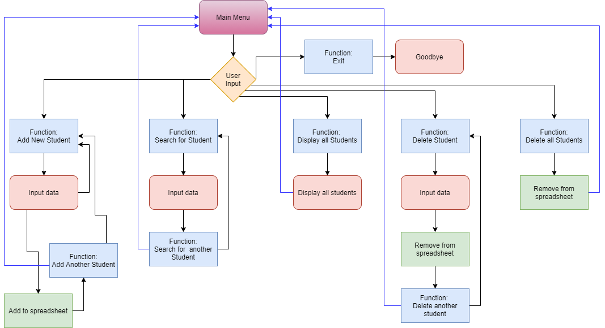

# Student Database

## Project Description
Students who join an 'English as a Second Language (ESL)' school will do a test on arrival to ascertain the student's level of English, and thus be placed in the correct classroom.  This project is to enable langauge schools to enter a new student onto a spreadsheet, enter the student's test results, calculate the student's level and allocate the student a unique student number.  Specific students are searchable (by student ID) and removable.
## UX Design
### User Stories
As a first time user, I want:
* an easy to understand interface with minimal options
* to be led through each process by the program
* to be able to return to the main menu easily

As a returning/frequent user, I want:
* to be able to find/remove students quickly

### Site Owner's Goals
As the owner of this program, I wanted to:
* create a program that is simple to follow
* create a program that allows users to store data on a Google Sheet by using the Google Drive and Google Sheets APIs
* add students individually
* use logic to calculate the student's level
* automatically generate a unique student number for each new student
* create a search function to display single students
* display every student stored on the spreadsheet
* remove individual students
* remove all students

### Structure

## Features
### Existing Features
### Features Left to Implement

## Technologies Used

## Testing
### Personal Testing
### Validation

## Deployment

## Credits

## Acknowledgements
