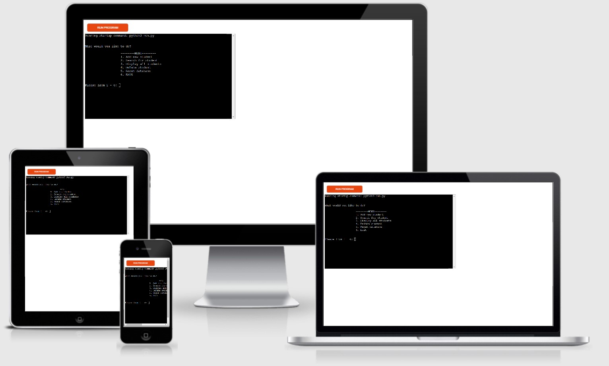

# Student Database

## Project Description
Students who join an 'English as a Second Language (ESL)' school will do a test on arrival to ascertain the student's level of English, and thus be placed in the correct classroom.  This project is to enable language schools to enter a new student onto a spreadsheet, enter the student's test results, calculate the student's level and allocate the student a unique student number.  Specific students are searchable (by student ID) and removable.

## UX Design

### User Stories

As a first time user, I want:
* an easy to understand interface with minimal options
* to be led through each process by the program
* to be able to return to the main menu easily

As a returning/frequent user, I want:
* to be able to find/remove students quickly

### Site Owner's Goals

As the owner of this program, I wanted to:
* create a program that is simple to follow
* create a program that allows users to store data on a Google Sheet by using the Google Drive and Google Sheets APIs
* add students individually
* use logic to calculate the student's level
* automatically generate a unique student number for each new student
* create a search function to display single students
* display every student stored on the spreadsheet
* remove individual students
* remove all students

### Structure

#### Flowchart

#### Database Structure

| Family Name | First Name | Nationality | Age | Test result | Level | Start Date | End Date   | Student Number |
|-------------|------------|-------------|-----|-------------|-------|------------|------------|----------------|
| Anderson    | Alex       | British     | 22  | 22          | B2    | 10-11-2021 | 11-11-2021 | 19             |
| Macintosh   | Graham     | Scottish    | 44  | 23          | B2    | 18-09-2021 | 25-12-2021 | 11             |
| Williams    | Bill       | Belgian     | 44  | 26          | C1    | 10-11-2021 | 10-12-2021 | 6              |

## Features

### Existing Features

#### Main Menu

Users have 6 options to choose from.  The menu was centred to make it more intuitive to users.  On this screen the user has access to any/all of the core functions in the program.

*** 

#### Add New Student

Users can enter a new student's details: family name, first name, nationality, age, test result, course start date, and course end date.  (Nationality was include as students in a language school are normally divided by language in order to force the student to use the target language more than their native)

Users do not need to enter the student's level as the programme will calculate it automatically based on the [CEFR](https://www.coe.int/web/common-european-framework-reference-languages/level-descriptions).

User also do not need to allocate a Student ID as this will be generated by the programme.

New students will be added to a Google Spreadsheet that the user does not have/need access to.  

The spreadsheet will automatically be sorted so by 'Family Name' - this will allow the 'Display All Students' function's output to be displayed alphabetically.

Users will also be able to add another new student without needing to return to the main menu.

*** 

#### Search for Student

Users will be able to search for students by their ID number.  This was designed to emulate a student handing over a 'Student Card' and the user searching using the number that would be present - similar to a university's matriculation number.

Users will be able to search for other students without returning to the main menu.

*** 

#### Display all students

Users will be able to see all of the students on the database, and all of the information stored on each one.  

This is to emulate a student losing their ID card and requesting information.  The output will display all students alphabetically and the user can find (and maybe in the futre 'print') their detials.

*** 

#### Delete Student

Users will be able to remove single students.  The search is similar to the 'Search for Student' feature, where the student can only be found by using the ID.  This removes the potential removal of a student with the same name.

Users will be given a confirmation screen to ensure that they have the correct student.

Users will be able to delete other students without returning to the main menu.

*** 

#### Reset Database

Users will be able to clear the entire spreadsheet.

Users will be given a confirmation screen to ensure that they really want to do this.

### Features Left to Implement
* In order to make this program more user friendly to the target audience (school administration dept), the ability to export the database (either as a whole or for individual student) to a printable format - such as a PDF.  
* The search function could be expanded to search by a student's name.

## Technologies Used

### Language

[Python 3](https://www.python.org/downloads/) - The entire project was written in Python 3

### Other Tools/Programs

[GSpread](https://docs.gspread.org/en/latest/) - for storing the 'student database' on an accessible spreadsheet

[GitHub](https://github.com/) - for storing my code in a public repository

[Gitpod](https://www.gitpod.io/) - for creating my code and pushing to GitHub

[Heroku](https://www.heroku.com/) - for deploying my code and generating a 'live' link for users as GitHub does not support this style of programming

[Draw.io](https://www.draw.io/) - to create the flowchart for the programme's structure

## Testing

### Validation
PEP8 Validation - http://pep8online.com/

### Known Bugs fixed

During development, there were many bugs that I faced but fixed by inserting print statements throughout.  However the following bugs required further research and/or help from my mentor.

* When inputting the student's start and end dates, if the student used an incorrect format the error was thrown twice.
    * The date_validation function was reworked to use two parameters and an IF statement to check both the format of the input and whether the start date comes before the end date

* When adding a new student, it was possible to set the student's age to zero.
    * An addition to the 'IF' statement was added to ensure that '0' would be raised as an error

* When the user input was being validated, the error message was being raised twice
    * This was due to calling a function twice - validate_data function now only called from within 'IF' statement

* Code was too long due to each comment taking up a minimum of 5 lines each
    * single function (display_message) created to be called when an error needs to be displayed

* PEP8 raised 'if values.isalpha() == False' should be 'if values.isalpha() is False'
    * Fixed accordingly

### Bugs remaining
At time of deployment, there are no known bugs.

## Deployment

This project was deployed in heroku and can be found: https://dougiemath-school-database.herokuapp.com/

### Steps to deployment

* Sign up and log in to [heroku.com](https://www.heroku.com/)
* Select 'Create New App'
* Name the project (must be a unique name), choose your region and click 'Create'
* Navigate to the settings tab (must be done before deploying code)
* Add 'Convig VAR'
    * This must include the details in the creds.json file
    * in the 'KEY' field, type 'CREDS'
    * in the 'VALUE' field, paste the entire contents of the creds.json file
* As I used a template provided by the Code Institute, I need to create a second VAR.  This is not necessary if you do not use their template.
    * In the 'KEY' field, type 'PORT'
    * in the 'VALUE' field, type '8000'
* Click 'Add Buildpack'
    * Select 'Python' and save changes
* Click 'Add Buildpack'
    * Select 'Node JS' and save changes
* Navigate to the Deploy tab
* Select GitHub as deployment method and confirm that you want to connect to your repository
* Enter the name of the repository and click 'connect'
* Once complete, choose the deployment method.  In the first instance, I selected 'Manual Deploys' and then selected 'Automatic Deploys'.  This will create a deployed link which displays a mock terminal. 

## Credits

All code was written by the developer.

## Acknowledgements

My mentor for the invaluable help and advice.

The Code Institute Slack community.
